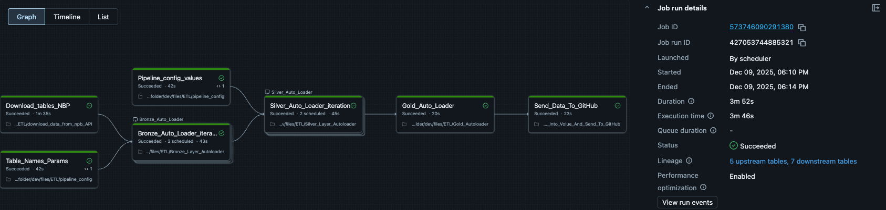

# Life_ETL – Fully Automated Databricks ETL Pipeline (NBP API)

## Overview

**Life_ETL** is a fully automated, end-to-end ETL (Extract–Transform–Load) data pipeline built on **Databricks**.  
It ingests financial data from the **Narodowy Bank Polski (NBP) public API**, transforms and cleans the data, and loads it into the target storage on a **daily automated schedule**.

The pipeline runs **once per day automatically** and sends an **email notification after each successful execution**, making it suitable for production-like use cases.

---

## Main Features

- ✅ **Automated daily ETL pipeline**
- ✅ **Real financial data ingestion from NBP API**
- ✅ **End-to-end Databricks job orchestration**
- ✅ **Automated email notification after each run**
- ✅ **Structured ETL layers (Extract, Transform, Load)**
- ✅ **Included testing, monitoring and Docker deployment**
- ✅ **Streamlit UI for data inspection**

---

## How the Pipeline Works

1. The Databricks job is triggered automatically **once per day** using the configured scheduler.
2. The pipeline performs:
   - **Extract** – Pulls raw financial data from the official **NBP API**.
   - **Transform** – Cleans, normalizes and processes the data.
   - **Load** – Saves the transformed data to the target storage location (GitHub).
   - It ueses the **Medalion Architecture** with Bronze, Silver and Gold Layer saving data to each layer.
3. After a successful run, the pipeline:
   - Sends an **automated email notification** as confirmation.
4. The processed data can be:
   - Visualized through the **Streamlit UI**
   - Used for analytics, reporting, or ML pipelines

---

## Screenshots / Diagrams Databricks Pipeline

### 1. Databricks Job Overview

### 2. ETL Pipeline Flow

## Technology Stack

- Python
- Databricks
- PySpark
- NBP Public API
- Streamlit UI
- Scheduling & Email Notifications
- PyTest
- Loguru
